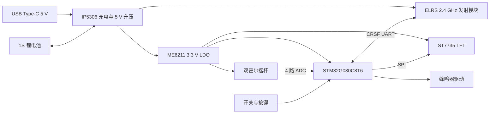

# 07 ELRS 遥控控制器硬件落地

## 1. 文档状态

本文记录配套手持遥控控制器的首版冻结硬件，作为 PCB 设计、采购、焊接、固件开发和板级联调的共同基线。

- 原理图名称：`ELRS_Remote_Controller`
- 主控：`STM32G030C8T6`
- 控制链路：外接 2.4 GHz 无线模块，通过 J6 5Pin (5V, GND, TX, RX) 接口通信。既支持标准 ELRS 2.4 GHz 发射模块（CRSF UART 协议），也原生 100% 兼容超高性价比 2.4 GHz 串口透传模块（如亿佰特 E34-2.4G20D / JDY-40，无需改板）
- 显示：外接 1.8 英寸 ST7735 SPI TFT
- 操纵输入：2 个 3.3 V 霍尔或电位器双轴摇杆（25.4×25.4mm M2），共 4 路 ADC
- 电池：单节 3.7 V 锂电池
- 充电接口：USB Type-C，仅充电，不支持 USB 数据
- 当前结果：原理图严格 ERC 为 0 致命错误、0 错误、0 警告；36 个板载 BOM 器件；PCB 一体化手柄裸板布局布线完成，双面接地铺铜完成，PCB DRC 0 错误全部通过
- 当前边界：原理图与 PCB 均已封板，待与飞控板一同/按需在嘉立创下单打样与贴片 (SMT)

## 2. 系统组成

控制器由一块自研主板和若干外接模块组成。ST7735、两个霍尔摇杆、ELRS 发射模块、拨动开关及锂电池均通过排针或线束外接，不属于板载 SMT 器件。

## 3. 板载硬件模块

| 模块       | 器件                          | 作用                                              |
| ---------- | ----------------------------- | ------------------------------------------------- |
| 主控       | STM32G030C8T6，LQFP-48        | ADC 采样、按键扫描、界面、CRSF 帧生成、蜂鸣器控制 |
| 充电与升压 | IP5306，ESOP-8                | Type-C 5 V 为 1S 电池充电，并把电池升压为系统 5 V |
| 3.3 V 电源 | ME6211C33M5G-N，SOT-23-5      | 5 V 转 3.3 V，供 MCU、TFT 逻辑和霍尔摇杆          |
| Type-C     | TYPE-C-31-M-12                | 仅使用 VBUS、GND、CC1、CC2；D+、D- 不连接         |
| 电池检测   | 10 kΩ / 10 kΩ + 100 nF        | 将 BAT 二分之一送入 MCU ADC，支持低电量报警       |
| 蜂鸣器     | S8050 + 1 kΩ + 无源蜂鸣器     | MCU PWM 驱动提示音                                |
| 充电指示   | IP5306 LED1 + 1 kΩ + 绿色 LED | 充电状态指示                                      |
| 电源按键   | SW3                           | 连接 IP5306 KEY，控制 5 V 升压输出状态            |
| 功能按键   | SW1、SW2                      | GPIO 对地按键，固件启用内部上拉                   |
| 调试接口   | 1×4 2.54 mm 排针              | 3.3 V、SWDIO、SWCLK、GND                          |

## 4. 电源链路与使用约束

### 4.1 电源链路

1. Type-C 的 `USB5V` 接入 IP5306 VIN。
2. 单节锂电池通过 J2 接入 `BAT` 和 `GND`。
3. IP5306 的升压输出形成 `+5V`，直接供 ELRS 模块和 ME6211。
4. ME6211 输出 `+3V3`，供 MCU、显示逻辑、摇杆、蜂鸣器和开关接口。
5. C9（100 µF）放在 ELRS 5 V 接口附近，吸收发射瞬态电流。

### 4.2 必须遵守的约束

- J2 没有反接保护，接电池前必须核对正负极；J2-1 为 BAT，J2-2 为 GND。
- Type-C 是充电口，不是 MCU 下载口；固件只能通过 SWD 下载。
- 首次联调将 ELRS 发射功率限制为 25 mW 或 50 mW，确认 5 V 压降、IP5306/电感温升和续航后再提高功率。
- 不应默认 IP5306 的充电电流适合任意小容量电池。采购电池前必须核对具体 IP5306 版本的实际充电电流，并保证电池允许的充电电流不低于实测值；不满足时必须修改充电方案后才能长期充电。
- 控制器开启后，ELRS 使用 5 V，MCU 与输入外设使用 3.3 V；禁止把 5 V 直接送入 MCU ADC/GPIO。

## 5. MCU 引脚分配

| MCU 引脚  | 网络              | 功能                    |
| --------- | ----------------- | ----------------------- |
| PA0       | JOY_LX            | 左摇杆 X 轴 ADC         |
| PA1       | JOY_LY            | 左摇杆 Y 轴 ADC         |
| PA2       | JOY_RX            | 右摇杆 X 轴 ADC         |
| PA3       | JOY_RY            | 右摇杆 Y 轴 ADC         |
| PA4       | BAT_SENSE         | 电池电压 ADC            |
| PA5       | TFT_SCK           | ST7735 SPI 时钟         |
| PA7       | TFT_MOSI          | ST7735 SPI 数据         |
| PA9       | CRSF_TX           | MCU 发送至 ELRS 模块 RX |
| PA10      | CRSF_RX           | MCU 接收 ELRS 模块 TX   |
| PA13      | SWDIO             | SWD 数据                |
| PA14      | SWCLK             | SWD 时钟                |
| PB0       | TFT_CS            | TFT 片选                |
| PB1       | TFT_DC            | TFT 数据/命令选择       |
| PB2       | TFT_RST           | TFT 复位                |
| PB3       | BUZZ_PWM          | 蜂鸣器 PWM              |
| PB4 / PB5 | SW_A_UP / SW_A_DN | 三段开关 A              |
| PB6 / PB7 | SW_B_UP / SW_B_DN | 三段开关 B              |
| PB8       | SW_C              | 两段开关 C              |
| PB9       | SW_D              | 两段开关 D              |
| PB10      | BTN1              | 功能按键 1              |
| PB11      | BTN2              | 功能按键 2              |

开关和按键均采用“GPIO 对 GND”的接法，固件必须启用内部上拉。三段开关的中间挡应表现为两个输入均为高电平；拨向两端时分别有一路被拉低。

## 6. 外接接口针序

针序以下表为唯一装配依据。制作线束时还必须对照 PCB 丝印方向，不能只看连接器外形。

### J2：1S 锂电池，1×2

| 针脚 | 网络          |
| ---: | ------------- |
|    1 | BAT，电池正极 |
|    2 | GND，电池负极 |

### J3：左霍尔摇杆，1×4

| 针脚 | 网络   |
| ---: | ------ |
|    1 | +3V3   |
|    2 | GND    |
|    3 | JOY_LX |
|    4 | JOY_LY |

### J4：右霍尔摇杆，1×4

| 针脚 | 网络   |
| ---: | ------ |
|    1 | +3V3   |
|    2 | GND    |
|    3 | JOY_RX |
|    4 | JOY_RY |

### J5：ST7735 显示模块，1×8 母座

| 针脚 | 网络     | 常见模块标识 |
| ---: | -------- | ------------ |
|    1 | +3V3     | VCC          |
|    2 | GND      | GND          |
|    3 | TFT_SCK  | SCL / SCK    |
|    4 | TFT_MOSI | SDA / MOSI   |
|    5 | TFT_CS   | CS           |
|    6 | TFT_DC   | DC / A0      |
|    7 | TFT_RST  | RES / RST    |
|    8 | +3V3     | BL / LED     |

不同 ST7735 模块的排针顺序可能不同。接入前必须逐针核对模块丝印；不一致时改线束，不能直接插入。

### J6：ELRS 发射模块，1×5

| 针脚 | 网络    | 连接 ELRS 模块 |
| ---: | ------- | -------------- |
|    1 | +5V     | 5 V / VCC      |
|    2 | GND     | GND            |
|    3 | CRSF_RX | 模块 TX        |
|    4 | CRSF_TX | 模块 RX        |
|    5 | NC      | 保留，不连接   |

UART 必须交叉连接：控制器 TX 接模块 RX，控制器 RX 接模块 TX。

### J7：SWD，1×4

| 针脚 | 网络                   |
| ---: | ---------------------- |
|    1 | +3V3，仅作目标电压参考 |
|    2 | SWDIO                  |
|    3 | SWCLK                  |
|    4 | GND                    |

### J8 / J9：三段开关，1×3

| 针脚 | J8      | J9      |
| ---: | ------- | ------- |
|    1 | SW_A_UP | SW_B_UP |
|    2 | GND     | GND     |
|    3 | SW_A_DN | SW_B_DN |

### J10 / J11：两段开关，1×2

| 针脚 | J10  | J11  |
| ---: | ---- | ---- |
|    1 | SW_C | SW_D |
|    2 | GND  | GND  |

## 7. 外接件采购规格

| 外接件                      | 数量 | 最低要求                                                 |
| --------------------------- | ---: | -------------------------------------------------------- |
| 3.3 V 霍尔双轴摇杆          |    2 | 每个提供 VCC、GND、X、Y；模拟输出范围不得超过 3.3 V      |
| ST7735 1.8 英寸 SPI TFT     |    1 | 3.3 V 逻辑、8 针接口；按 J5 针序制作转接线               |
| ELRS 2.4 GHz 发射模块       |    1 | 支持 CRSF UART、5 V 供电；优先带匹配天线的成品模块       |
| 三段拨动开关 SPDT ON-OFF-ON |    2 | 中间公共端接 GND，两侧接信号                             |
| 两段拨动开关 SPST 或 SPDT   |    2 | 实现信号对 GND 的通断                                    |
| 1S 锂电池                   |    1 | 带保护板优先；容量和允许充电电流须满足第 4.2 节          |
| 2.54 mm 线束/端子           | 若干 | 与 J2～J11 针序匹配并做好防反插标识                      |
| ST-Link 或 DAP-Link         |    1 | 支持 3.3 V SWD，仅连接参考电压，不从调试器强行给整板供电 |

## 8. 板载 BOM 基线

下表数量为制作 **1 块控制器** 的净用量，不包含损耗和备件。

| 位号         | 器件                     | 嘉立创/LCSC 编号 | 数量 |
| ------------ | ------------------------ | ---------------- | ---: |
| U1           | STM32G030C8T6            | C529329          |    1 |
| U2           | IP5306                   | C181692          |    1 |
| U3           | ME6211C33M5G-N           | C82942           |    1 |
| J1           | TYPE-C-31-M-12           | C165948          |    1 |
| Q1           | S8050 J3Y                | C2146            |    1 |
| BZ1          | CUI CST-931AP 无源蜂鸣器 | C9900006511      |    1 |
| LED1         | KT-0603G 绿色 LED        | C12624           |    1 |
| SW1～SW3     | TS-1088-AR02016          | C720477          |    3 |
| L1           | 2.2 µH，CKST322512       | C3002559         |    1 |
| R1、R2       | 5.1 kΩ 0603 1%           | C23186           |    2 |
| R3、R4       | 10 kΩ 0603 1%            | C25804           |    2 |
| R5、R6       | 1 kΩ 0603 1%             | C21190           |    2 |
| C1～C4       | 10 µF 0603               | C19702           |    4 |
| C5～C8       | 100 nF 0603              | C14663           |    4 |
| C9           | 100 µF / 6.3 V           | C15008           |    1 |
| J2、J10、J11 | PZ254V-11-02P            | C492401          |    3 |
| J3、J4、J7   | PZ254V-11-04P            | C2691448         |    3 |
| J5           | 2.54 mm 1×8 母座         | C27438           |    1 |
| J6           | PZ254V-11-05P            | C492404          |    1 |
| J8、J9       | PZ254V-11-03P            | C2937625         |    2 |

BZ1 当前使用扩展库器件，生成生产 BOM 前应再次确认库存、价格、引脚间距和是否为无源蜂鸣器；如替换，必须保持 9 mm 直插、4 mm 脚距及相同电气类型，随后重新执行 ERC 和 PCB DRC。

## 9. 固件最低功能

首版固件至少实现：

1. 上电保持安全状态，完成 MCU、ADC、TFT 和 CRSF 自检。
2. 四路摇杆 ADC 滤波、中心校准、行程校准、死区和归一化。
3. 两个三段开关、两个两段开关和两个按键去抖及状态映射。
4. 按 CRSF 通道格式周期发送控制量，并监测模块返回数据或链路状态。
5. ST7735 显示电池电压、摇杆/通道值、开关状态和链路状态。
6. 电池低压、链路异常、校准错误和上电摇杆不安全时通过界面及蜂鸣器报警。
7. SWD 可下载和调试；保留出厂 ADC 校准参数和用户摇杆校准参数。

## 10. 上电与验收顺序

1. 首次上电不接 TFT、摇杆和 ELRS，使用限流电源检查 BAT、USB5V、5 V 和 3.3 V 是否短路；此时板载 MCU 可保持未烧录状态。
2. 接 1S 电池，确认 IP5306 按键、5 V 输出和 Type-C 充电状态正常，测量充电电流与温升。
3. 确认 3.3 V 稳定后，通过 SWD 识别 STM32G030C8T6 并下载最小程序。
4. 分别验证 LED、蜂鸣器、按键、拨动开关和四路 ADC；完成摇杆校准。
5. 单独连接 TFT，确认供电、方向、颜色和刷新稳定。
6. 最后连接 ELRS，先以低发射功率验证 CRSF 收发、5 V 压降、纹波及温升。
7. 连续运行 30 分钟，记录电池电压、5 V/3.3 V、各电源器件温升和链路状态。

满足以下条件后才可冻结控制器 PCB：原理图 ERC 为 0、PCB DRC 为 0、所有网络已布通、接口丝印含针脚定义、电池极性有醒目标识、天线净空符合所购 ELRS 模块要求，并完成一次实板低功率联调。
