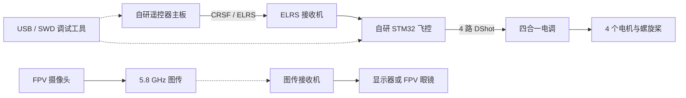
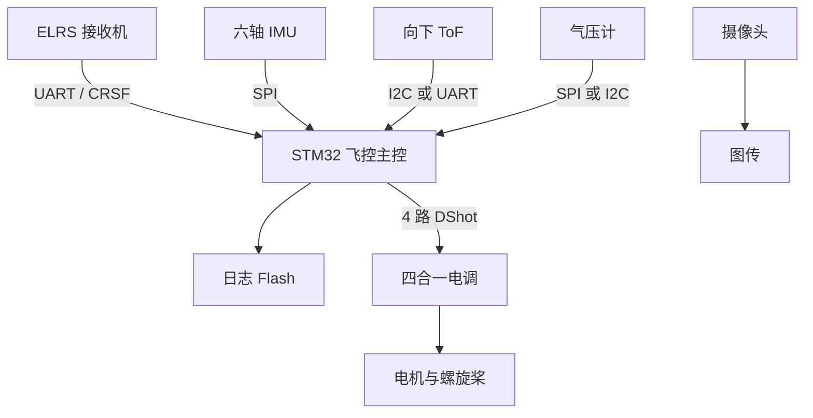
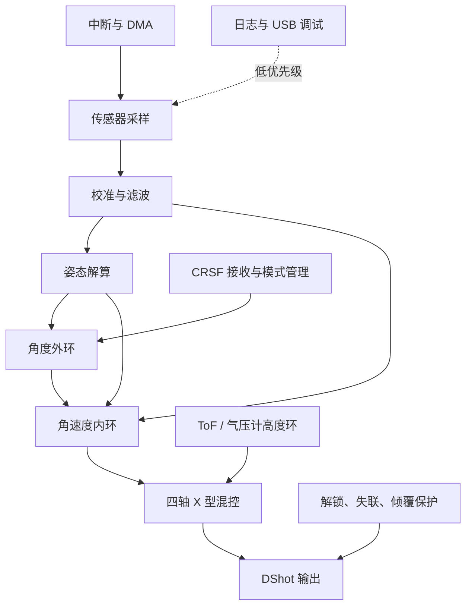
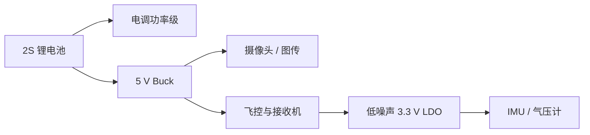

# 四轴无人机项目架构

## 1. 项目目标与首版边界

这是一个以学习为目的、从零实现的四轴无人机项目，覆盖嵌入式软件、控制算法、PCB、机械建模和通信协议。

首版自研：

- 飞控主板与飞控软件；
- 遥控器主板与遥控器软件；
- 机架、安装结构和 3D 打印件。

首版复用成熟模块：

- ELRS 2.4 GHz 射频模块与接收机；
- 四合一无刷电调；
- FPV 摄像头、5.8 GHz 图传和接收端。

首版明确不做：自研射频、自研电调、GPS、自动航线和位置悬停。

## 2. 系统边界

系统由四个相对独立的子系统组成：飞行器、遥控器、图像接收端、开发调试工具。控制链路和图像链路分离，调试工具通过 USB 连接飞控或遥控器。

## 3. 飞行器硬件架构

### 3.1 首版飞控板功能

- STM32 主控，具体型号以定时器、DMA、SPI、UART 和 USB 资源核对后确定；
- IMU 优先使用 SPI，布置在板上低振动区域；
- 一路 CRSF UART，支持 DMA 和失联检测；
- 四路定时器 DMA DShot 输出；
- USB、SWD、状态 LED、蜂鸣器接口和物理解锁输入；
- SPI NOR Flash 日志；
- ToF、气压计和扩展 UART/I2C 接口；
- 电压、电流采样接口，为后续电池监测预留。

飞控板与大电流电调分开。电调、电池和电机线不经过 IMU 区域。

## 4. 飞控软件架构

任务频率建议：

| 功能 | 频率 |
| --- | ---: |
| IMU 采样、角速度环、DShot | 1~4 kHz |
| 姿态解算、角度环 | 500~1000 Hz |
| ToF、高度环 | 50~100 Hz |
| 气压计 | 25~50 Hz |
| 日志、参数保存、USB 命令 | 后台任务 |

软件分为驱动层、设备层、控制层、状态机和调试层。传感器数据必须带时间戳；控制循环与日志任务之间使用快照或双缓冲，避免阻塞控制环。

## 5. 遥控器架构

双霍尔摇杆、解锁/模式开关接入 STM32 遥控器主控。主控负责 ADC 采样、死区和曲线处理、状态显示及蜂鸣器控制，再通过 CRSF UART 连接成熟 ELRS 发射模块。

遥控器首版必须具备上电自检、摇杆校准、低电量提示和失联前状态提示。

## 6. 电源与 PCB 布局

- 5 V Buck、图传电源与飞控数字电源分区；
- IMU 使用独立、低噪声 3.3 V 电源，靠近芯片放置去耦；
- 降压电感、电机线和 DShot 功率回路远离 IMU；
- 摄像头、图传和飞控共地，但图传电源增加滤波；
- 首版预留测试点：电池电压、5 V、3.3 V、UART、SPI、DShot 和解锁信号。

## 7. 安全状态

上电默认为锁定。只有遥控链路有效、传感器自检通过且满足解锁条件时才允许输出电机信号。必须实现遥控失联超时、倾覆保护、电机启动保护、异常复位后保持锁定，以及 USB 调试时禁止电机输出。

## 8. 研发阶段与验收标准

1. **桌面飞控板**：完成供电、USB/SWD、IMU、Flash、四路 DShot；能实时查看传感器和输出数据。
2. **单轴实验架**：验证姿态解算、角速度环和电机方向，确认失联与急停有效。
3. **遥控链路**：完成遥控器主板、CRSF 通信、校准、模式和低电量提示。
4. **四轴测试架**：完成 X 型混控、解锁状态机和限幅，先无桨验证。
5. **机械样机**：锁定电机、螺旋桨、电池、电调和 PCB 后建立机架与 3D 打印件。
6. **首次飞行**：先手动/角度模式，再单独验证 ToF 高度环。
7. **图传集成**：飞行稳定后安装摄像头和图传，重新检查重心、供电噪声和 PID。

每个阶段都应保留测试记录、参数版本和已知问题，未通过当前阶段验收前不进入下一阶段。
