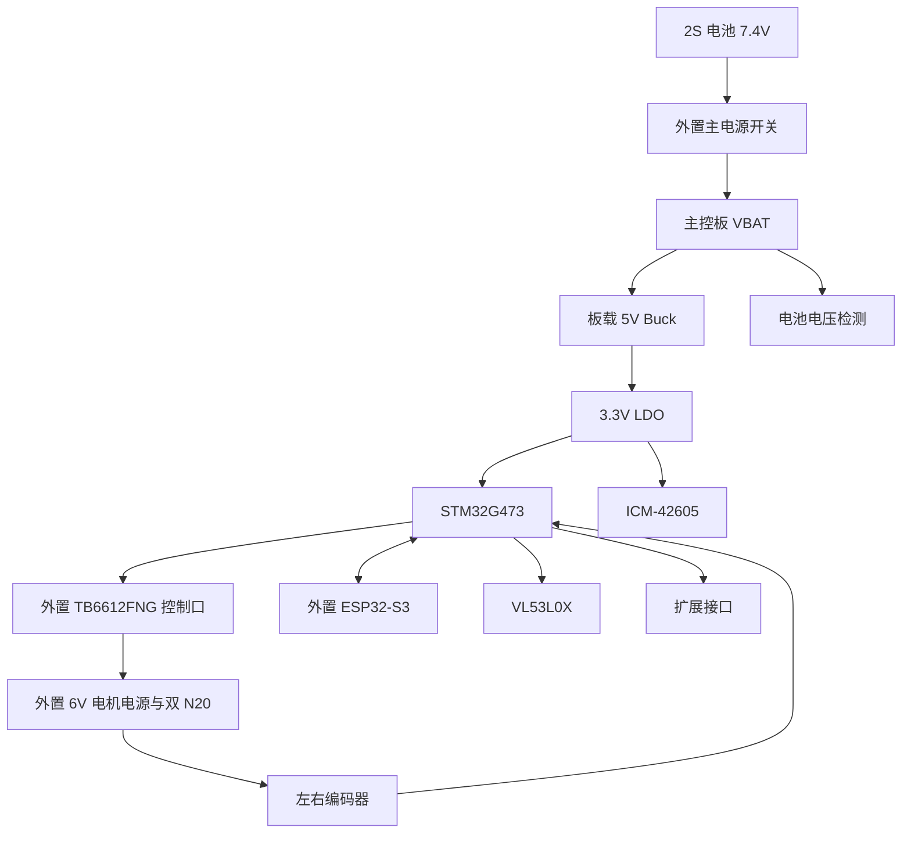

# V1 机器人主控板原理图设计

> 状态：原理图设计基线，待在 EDA 工具中实现与审查。
>
> 目标：设计一块新的机器人主控 PCB，复用已购的 STM32G473RCT6、ICM-42605、W25Q128 与电源相关 BOM 器件；不复用原无人机飞控 PCB 的板框、接口布局和 DShot 输出定义。

## 1. 设计边界

- **本板负责实时控制**：IMU 采样、双编码器采集、姿态解算、平衡 PID、TB6612 控制、电池电压检测和故障保护。
- **外置 ESP32-S3 负责非实时功能**：Wi-Fi/BLE、语音、OLED 和未来视觉模块。ESP32 只能通过 UART 发送高层运动目标，不能直接连接电机驱动输入。
- TB6612FNG、LM2596 6 V 降压模块、INMP441、MAX98357A、OLED、VL53L0X 都是外置模块，不放入本板 BOM。
- 本板接收 2S 电池的 `VBAT`（标称 7.4 V，满电 8.4 V），在板上生成 5 V 和 3.3 V；电机电源由外置 LM2596 单独降至 6.0 V。
- V1 不安装摄像头或雷达，但必须保留标准扩展接口。

## 2. 原理图页面划分

在 EasyEDA Pro、KiCad 或同类 EDA 中创建以下 6 个层次原理图页面。每页使用网络标签连接，避免跨页长线。

| 页码 | 页面名称          | 包含内容                                                                |
| ---- | ----------------- | ----------------------------------------------------------------------- |
| 01   | `POWER`           | 2S 输入、反接/过流策略、5 V Buck、3.3 V LDO、去耦、电池 ADC、各电源接口 |
| 02   | `MCU_DEBUG`       | STM32G473RCT6、8 MHz 晶振、BOOT0、NRST、SWD、状态 LED                   |
| 03   | `IMU_FLASH`       | ICM-42605 的 SPI1/中断、W25Q128 的 SPI2、各自电源去耦                   |
| 04   | `MOTOR_ENCODER`   | TB6612 控制接口、左右 AB 相编码器接口、6 V 电机电源/地参考              |
| 05   | `COMM_SENSOR`     | ESP32-S3 UART、VL53L0X I2C、两个扩展 I2C/UART、GPIO 扩展口              |
| 06   | `CONNECTOR_TABLE` | 所有外部连接器的针序、丝印网络名与测试点                                |

## 3. 系统连接关系

## 4. 推荐 GPIO 和外设资源表

下表是当前原理图的**推荐分配**。绘制前必须在所用 STM32G473RCT6 符号与 ST 官方数据手册中逐项核对封装引脚、复用功能和定时器通道；未经核对不得直接投板。

| 功能             | STM32 网络        | 外设/模式         | 连接对象                 | 说明                                                       |
| ---------------- | ----------------- | ----------------- | ------------------------ | ---------------------------------------------------------- |
| IMU SPI 时钟     | `PA6`             | `SPI1_SCK`        | ICM-42605 AP_SCL/AP_SCLK | 原飞控图已确认分配                                         |
| IMU SPI MISO     | `PA4`             | `SPI1_MISO`       | ICM-42605 AP_SDO         | 原飞控图已确认分配；MCU 读取 IMU                           |
| IMU SPI MOSI     | `PA7`             | `SPI1_MOSI`       | ICM-42605 AP_SDI         | 原飞控图已确认分配；MCU 写入 IMU                           |
| IMU 片选         | `PA5`             | GPIO 输出         | ICM-42605 AP_CS          | 原飞控图已确认分配                                         |
| IMU 中断         | `PC4`             | EXTI 输入         | ICM-42605 INT1           |                                                            |
| Flash 时钟       | `PB13`            | `SPI2_SCK`        | W25Q128 CLK              | 复用旧板已确认分配                                         |
| Flash MISO       | `PB14`            | `SPI2_MISO`       | W25Q128 DO               |                                                            |
| Flash MOSI       | `PB15`            | `SPI2_MOSI`       | W25Q128 DI               |                                                            |
| Flash 片选       | `PB12`            | GPIO 输出         | W25Q128 CS               |                                                            |
| 左电机 PWM       | `PC6`             | `TIM3_CH1 PWM`    | TB6612 PWMA              | 频率建议 20 kHz                                            |
| 右电机 PWM       | `PC7`             | `TIM3_CH2 PWM`    | TB6612 PWMB              | 频率建议 20 kHz                                            |
| 左电机方向 A1/A2 | `PC8` / `PC9`     | GPIO 输出         | TB6612 AIN1/AIN2         |                                                            |
| 右电机方向 B1/B2 | `PA15` / `PB0`    | GPIO 输出         | TB6612 BIN1/BIN2         |                                                            |
| 驱动使能         | `PB1`             | GPIO 输出         | TB6612 STBY              | 默认下拉，MCU 明确置高后才允许电机输出                     |
| 左编码器 A/B     | `PA0` / `PA1`     | `TIM2` 编码器模式 | 左 N20 编码器            | 需确认实际模块是 AB 相正交输出                             |
| 右编码器 A/B     | `PA8` / `PA9`     | `TIM1` 编码器模式 | 右 N20 编码器            | 避开 I2C 与 BOOT0                                          |
| ESP32 UART TX    | `PA2`             | `USART2_TX`       | ESP32 RX                 | 3.3 V TTL，交叉连接                                        |
| ESP32 UART RX    | `PA3`             | `USART2_RX`       | ESP32 TX                 |                                                            |
| ToF I2C SCL      | `PB6`             | `I2C1_SCL`        | VL53L0X SCL              | 3.3 V 上拉                                                 |
| ToF I2C SDA      | `PB7`             | `I2C1_SDA`        | VL53L0X SDA              | 3.3 V 上拉                                                 |
| 备用 I2C SCL/SDA | `PB10` / `PB11`   | `I2C2`            | 扩展 I2C 接口            | 3.3 V 上拉                                                 |
| 电池电压检测     | `PC0`             | ADC               | 电阻分压                 | 独立于编码器与通信资源                                     |
| SWD              | `PA13` / `PA14`   | SWDIO / SWCLK     | 调试接口                 | 不复用                                                     |
| 复位             | `NRST`            | 复位              | SWD 接口                 |                                                            |
| BOOT0            | `PB8` / Boot 配置 | 启动配置          | 下拉/跳帽                | 与 I2C1 SCL 存在潜在冲突，必须由实际芯片复用和启动配置确认 |

## 5. 已消除的资源冲突与绘制前核对

当前分配已主动避开两个常见冲突：

1. 左编码器固定使用 `PA0/PA1` 的 TIM2 编码器模式；电池 ADC 固定迁移到 `PC0`，两者不再共享引脚。
2. `PB8` 保留给 BOOT0 启动配置；前向 ToF 改为使用 `PB6/PB7` 的 I2C1，右编码器改用 `PA8/PA9` 的 TIM1 编码器模式。

电池输入为 8.4 V，使用分压和 RC 滤波，将 `BAT_SENSE` 的 ADC 电压始终限制在 0 到 3.3 V。具体分压阻值在 `POWER` 页根据 ADC 采样阻抗设计。

开始绘图前，仍必须使用 STM32G473RCT6 数据手册和所选 EDA 符号逐项核对封装管脚与复用功能；这一步是封板前的必需复核，不允许依赖本文档替代芯片数据手册。

## 6. 每页必须画出的电路

### 6.1 `POWER`

- `J1`（功能名称：`BAT_IN`）：2 Pin，`VBAT`、`GND`，接外置主开关后的 2S 电池。`J_BAT` 只是本文档此前使用的功能名，不是需要在元件库中搜索的固定器件名称。
- 原无人机飞控以 `H1` 8 针接口中的 `VBAT_RAW` 与 `GND` 接收电池；新机器人板不需要复用 H1。搜索并放置一个普通的 2 Pin 连接器即可，例如 `HDR-M-2.54_1x2P` 或与电池线束匹配的 JST 2 Pin 连接器，然后将位号设为 `J1`、网络标签设为 `VBAT` 和 `GND`。
- 输入保护：保留保险丝/自恢复保险丝焊盘和反接保护位置；具体选型待电源方案确认。
- `SY8120IABC`：按原无人机飞控中已经采购的 Buck 方案，将 `VBAT` 降至 `+5V`。必须沿用芯片数据手册推荐电感、二极管/同步拓扑和输入输出电容，不能凭经验替代。
- `ME6211C33`：将 `+5V` 降至 `+3V3`，MCU、IMU、Flash 和 3.3 V 接口使用该网络。
- 电池检测：`VBAT -> 上分压电阻 -> BAT_SENSE -> 下分压电阻 -> GND`；BAT_SENSE 并联 100 nF，接独立 ADC 引脚。
- `J_5V_OUT`：给 ESP32-S3 或未来模块的 5 V/GND 输出；电流预算和线径需在 PCB 前复核。
- `J_3V3_OUT`：给 ToF 和低功耗传感器的 3.3 V/GND 输出。
- 每个电源入口和 MCU/IMU/Flash 附近放置 100 nF 去耦；Buck/LDO 旁的电容严格遵循数据手册。

### 6.2 `MCU_DEBUG`

- STM32G473RCT6 LQFP-64。
- 8 MHz 晶振接 `PF0/PF1`，配套两颗负载电容按晶振规格计算；参考旧板使用的 15 pF C0G，但以新晶振规格书为准。
- 每组 `VDD/VSS` 旁放置 100 nF；`VDDA` 采用模拟电源滤波与去耦。
- `SWD` 4 Pin：`3V3, SWDIO, SWCLK, GND`；额外引出 `NRST` 测试点或 5 Pin 调试口。
- `BOOT0` 默认下拉，必要时通过跳帽/焊盘允许拉高；不可悬空。
- `NRST` 上拉与复位按键/测试点。
- `STATUS_LED` 采用限流电阻接一个空闲 GPIO；不要与电机、编码器和调试脚冲突。

### 6.3 `IMU_FLASH`

- ICM-42605 使用 SPI，供电为 3.3 V；CS 默认上拉，INT1 接 MCU EXTI。
- IMU 电源处放 100 nF 与 1 uF 去耦，靠近芯片。
- W25Q128 使用 SPI2，CS 上拉，供电 3.3 V，放 100 nF 去耦。
- IMU 区域在 PCB 布局时远离 Buck 电感、电机电源和连接器大电流回路。

### 6.4 `MOTOR_ENCODER`

- `J_TB6612`：建议 1x10 或 2x5，至少引出 `3V3, GND, PWMA, AIN1, AIN2, PWMB, BIN1, BIN2, STBY`，其余针脚预留/对地。
- TB6612 的 `VM` 不经过主控板逻辑电源；由外置 LM2596 的 6.0 V 直接进入 TB6612 模块。
- STM32 到 TB6612 的所有控制信号是 3.3 V 逻辑；STBY 增加外部下拉，确保 MCU 复位和未上电时电机保持禁止。
- `J_ENC_L`、`J_ENC_R`：每组至少 `3V3, GND, ENC_A, ENC_B`。若电机是 6 芯插头且电机两线也要走同一插座，则使用 1x6 并标清 `M+, M-, VCC, GND, A, B`。
- 编码器输入可预留串联电阻/上拉电阻焊盘，待确认编码器输出类型、工作电压和线束长度后确定装配值。

### 6.5 `COMM_SENSOR`

- `J_ESP32`：`5V, GND, STM_TX, STM_RX, ESP_RESET(optional)`。UART 必须交叉接线，全部信号为 3.3 V。
- `J_TOF_FRONT`：`3V3, GND, I2C1_SCL, I2C1_SDA`；可额外加 `XSHUT`、`INT` 用于后续多个 ToF 的地址控制与中断。
- `J_I2C_EXT`：`3V3, GND, I2C2_SCL, I2C2_SDA`。
- `J_UART_EXT`：`5V or 3V3, GND, UART_TX, UART_RX`；丝印必须标明电平。
- `J_GPIO_EXT`：`3V3, GND` 和至少 6 个确认未复用的 GPIO。

## 7. 原理图审查清单

在进入 PCB 之前，必须逐项通过：

- [ ] STM32 每个电源/地管脚均已连接，所有去耦电容完整。
- [ ] 晶振、BOOT0、NRST、SWD 电路与 STM32G473 数据手册一致。
- [ ] IMU 型号明确为 ICM-42605，SPI 模式、CS、INT 和电源去耦无误。
- [ ] TB6612 的控制线为 3.3 V，且 STBY 在任何复位状态下默认为低。
- [ ] N20 编码器的实际线序、电压和输出类型已经到货确认。
- [ ] `VBAT` 不会进入 6 V 电机端；TB6612 `VM` 的来源明确标注为外置、已调至 6.0 V 的 LM2596。
- [ ] 2S 满电 8.4 V 时，BAT_SENSE ADC 电压不超过 3.3 V。
- [ ] ESP32、ToF、扩展接口的信号电平、针序和电源电压均已标在连接器丝印中。
- [ ] 所有电机相关大电流线路与 IMU/模拟采样区域在 PCB 布局规则中隔离。
- [ ] 已完成 EDA ERC，所有剩余警告都有明确、可接受的原因。
