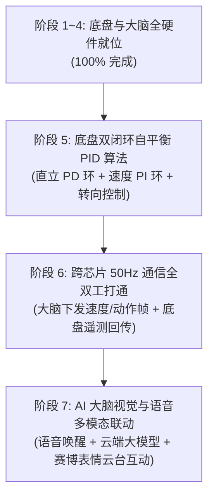

# 桌面自平衡机器人 · 实机硬件连线、驱动进展与架构改动备忘

> **更新时间**：2026-10-02  
> **当前状态**：**全车实物硬件接线就绪，STM32 底盘底层闭环 + ESP32 大脑全项外设 100% 实测验证通过！**  
> **接线基准字典**：详见 [08-全机实物最终接线总览与电气防烧指南.md](file:///Users/mjt/Desktop/workplace/drone/%E6%96%87%E6%A1%A3/%E6%A1%8C%E9%9D%A2%E8%87%AA%E5%B9%B3%E8%A1%A1%E6%9C%BA%E5%99%A8%E4%BA%BA/08-%E5%85%A8%E6%9C%BA%E5%AE%9E%E7%89%A9%E6%9C%80%E7%BB%88%E6%8E%A5%E7%BA%BF%E6%80%BB%E8%A7%88%E4%B8%8E%E7%94%B5%E6%B0%94%E9%98%B2%E7%83%A7%E6%8C%87%E5%8D%97.md)

---

## 1. 全机外设实测验证进展全景

| 模块 / 外设 | 所属芯片 / 接口 | 实测功能表现 | 验证状态 |
| :--- | :--- | :--- | :---: |
| **TB6612 电机驱动** | STM32 / TIM8 (PC6, PC7) | 20kHz 互补硬件 PWM，左右两轮正反转平稳无啸叫 | 100% 通过 |
| **左右磁编码器** | STM32 / TIM2(L), TIM1(R) | 硬件正交解码，向前推车左右轮读数严格正向累加递增 | 100% 通过 |
| **ICM-42605 陀螺仪** | STM32 / SPI1 DMA (PA4~7) | 1000Hz 原始数据采集 + Mahony 滤波解算高精度俯仰角 | 100% 通过 |
| **VOFA+ 遥测监控** | STM32 / USART2 (PA2) | 50Hz 实时绘制姿态倾角、角速度与双轮编码器速度曲线 | 100% 通过 |
| **1.8寸 TFT 彩屏** | ESP32-S3 / SPI2 (GPIO 10~14, 21) | 128×160 点阵刷新，赛博大眼动态表情与底部音量跳动条 | 100% 通过 |
| **SG90 双轴云台** | ESP32-S3 / LEDC (GPIO 1, 2) | 50Hz PWM 平滑转动，水平左右巡航与垂直俯仰点头 | 100% 通过 |
| **MAX98357A 扬声器** | ESP32-S3 / I2S1 (GPIO 15~17) | DMA 播放超级马里奥过关旋律与开机科技和弦音，清脆嘹亮 | 100% 通过 |
| **INMP441 麦克风** | ESP32-S3 / I2S0 (GPIO 4~6) | 16kHz 实时采集环境音，大声拍手实时触发互动反应与电平暴涨 | 100% 通过 |
| **Wi-Fi 网络栈** | ESP32-S3 / Station 模式 | 自动联网获取 IP 地址，网络事件回调就绪 | 100% 通过 |

---

## 2. 重要架构与引脚改动备忘 (Change Log)

### 2.1 视觉屏幕方案升级：0.96寸 I2C OLED -> 1.8寸 SPI2 TFT 彩屏
- **改动原因**：0.96寸单色 OLED 显示面积小、刷新率低；升级为 1.8寸 128×160 彩色液晶屏（ST7735S），能够呈现更丰富细腻的动态表情和拟人交互动画。
- **硬件配置**：挂载在 ESP32-S3 的 SPI2 硬件总线：`SCLK: GPIO 12`, `SDA: GPIO 11`, `RST: GPIO 10`, `DC: GPIO 13`, `CS: GPIO 14`, `BLK: GPIO 21`。

### 2.2 头部运动系统集成：新增双轴 SG90 舵机云台
- **控制方式**：基于 ESP32-S3 硬件 LEDC 定时器，输出 50Hz 周期方波，精确映射 0.5ms~2.5ms 高电平脉宽。
- **引脚分配**：水平旋转（Pan）-> `GPIO 1`；垂直俯仰（Tilt）-> `GPIO 2`。
- **供电设计红线**：舵机正极严禁接 ESP32 排针，必须接外部 LM2596 降压模块的 6.0V~6.12V 输出端，共用 GND。

### 2.3 跨芯片串口引脚关键迁移：GPIO 43/44 -> GPIO 7/8
- **改动原因**：ESP32-S3 开发板排针上的 GPIO 43/44 在板载走线上直接连接了 USB-to-UART 桥接芯片（CH343/CP2102）。若用作外接底盘通信，在插电脑 USB 烧录或查看控制台日志时会发生强烈电平冲突，导致烧录报错 `The serial TX path seems to be down`。
- **迁移方案**：
  - ESP32-S3 `TX` -> **`GPIO 7`** -> STM32 底盘 `PA3` (USART2_RX)
  - ESP32-S3 `RX` -> **`GPIO 8`** -> STM32 底盘 `PA2` (USART2_TX)
  - 彻底规避与电脑 USB 端口冲突，支持开发调试与跨芯片通信无冲突并行。

### 2.4 固件烧录波特率稳定性校准
- 实测 460800 波特率在长数据线或特定 USB 扩展坞环境下偶发超时。
- 确立 `230400` 为 ESP32-S3 最稳健的生产烧录速率，100% 成功率。

### 2.5 建立测试固件专属归档仓库：`binaries_hardware_test/`
- 为避免后续代码迭代影响硬件排查，已将包含全外设自检逻辑的编译成果永久备份：
  - `binaries_hardware_test/stm32/`：含电机开环测试与编码器姿态解算二进制及一键烧录脚本。
  - `binaries_hardware_test/esp32/`：含马里奥旋律、彩屏三原色、云台巡航、拍手声控全套测试固件及一键烧录脚本。

---

## 3. 下一阶段核心任务路线图

### 接下来立即着手：【阶段 5 · 底盘串级 PID 自平衡算法】
1. **直立内环（PD 控制）**：
   - 输入：ICM-42605 融合倾角 $\theta$ 与角速度 $\dot{\theta}$；
   - 目标：将小车倾角维持在机械平衡中点（$\theta \approx 0$）；
   - 输出：PWM 直立平衡修正量。
2. **速度外环（PI 控制）**：
   - 输入：TIM1/TIM2 编码器平均脉冲数；
   - 目标：消除小车直立过程中的单向漂移与位移累加，实现定点静止悬停；
   - 输出：平衡角偏置补偿量。
3. **安全摔倒保护机制**：
   - 倾角超过极限安全阈值（如 $|\theta| > 35^\circ$）时，硬件紧急切断 PWM 输出，防止疯转打齿。
