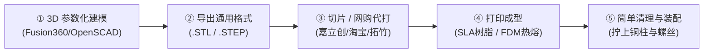

# 🖨️ 3D 打印模型全流程与实操指南 (从建模到成品)

3D 打印的完整工作流非常标准化，分为 **5 个核心阶段**：

---

## 1. 阶段一：3D 建模设计 (CAD Modeling)
* **使用的软件**：
  * **新手/极客推荐**：Fusion 360、Tinkercad、OpenSCAD（参数化代码建模）；
  * **工业级**：SolidWorks、Creo。
* **桌面机器人的建模核心要点**：
  * **预留公差**：螺丝孔如果是 M3 螺丝，孔径要建为 **3.2mm**（防止塑料收缩螺丝穿不进）；
  * **壁厚强度**：承重外壁厚度至少 **2.0mm ~ 3.0mm**，确保小车撞击摔倒时不裂开；
  * **分层装配设计**：按“底层电机”、“中层电池”、“顶层主控”分层画，用螺柱上下贯通。

---

## 2. 阶段二：导出 3D 打印通用格式
建模完成后，软件里点击导出（Export）：
* **`.STL` 文件**：3D 打印全球通用的三角网格模型格式（所有切片软件和代打印平台直接支持）；
* **`.STEP` 文件**：工业级实体模型，方便二次修改或高精度光固化打样。

---

## 3. 阶段三：获取 3D 打印实物的两种途径

### 途径 A：网购代打印（⭐ 无打印机首选，极便宜、超精细！）

如果你手头没有 3D 打印机，现在国内的 3D 打印代工已经便宜到“白菜价”：

1. **推荐平台**：
   * **嘉立创（三维猴 3D 打印）**：在嘉立创 App 或官网直接上传 `.stl` 文件，系统自动秒级报价；
   * **淘宝 / 拼多多 3D 打印店**：搜 `3D打印代打`，把 `.stl` 文件发给客服。
2. **材料与工艺选择**：
   * **推荐选「SLA 光固化白模（9000R 或 8001 树脂）」**；
   * **优点**：表面像陶瓷一样光滑如镜，完全没有塑料层纹，尺寸精度高达 0.05mm；
   * **花费**：我们桌面机器人的 3 个小板子总重不到 50 克，**整套打下来只要 10 ~ 15 元包邮**，隔天就顺丰送到家！

---

### 途径 B：自己有 3D 打印机（拓竹 Bambu / 创想等）

如果你自己或朋友有 3D 打印机，只需 3 步：

1. **导入切片软件**：把 `.stl` 文件拖进 **Bambu Studio / Cura / PrusaSlicer**；
2. **设置切片参数**：
   * **耗材**：PLA+ 或 PETG；
   * **填充率（Infill）**：`25% ~ 30%`（陀螺仪 Gyroid 填充，抗摔减震最佳）；
   * **层高**：`0.20 mm`；
   * **外壳壁厚**：`3 层`。
3. **点击「切片」并发送打印**：生成 `.gcode` 打印指令，通过 WiFi 发给打印机，约 1~2 小时自动打完。

---

## 4. 阶段四：后处理与清理 (Post-Processing)
* **SLA 光固化树脂件**：厂家发过来前已经完成酒精清洗和紫外线二次固化，拿出来吹吹灰就能直接用；
* **FDM 自打件**：用小斜口钳把底部的微量支撑条剥离剪平即可。

---

## 5. 阶段五：五金螺丝与主板总装 (Assembly)
1. 用 4 颗 M2 螺丝把两颗 N20 电机锁在底层底盘上；
2. 拧上 4 根 M3×20mm 铜柱，扣上中层电池仓；
3. 再拧上 4 根 M3×25mm 铜柱，将焊好的 **STM32 主控板（30.5×30.5mm孔）** 锁在顶层；
4. 左右两边插上 43mm 橡胶小轮，插上 TB6612 连线，整机装配大功告成！
